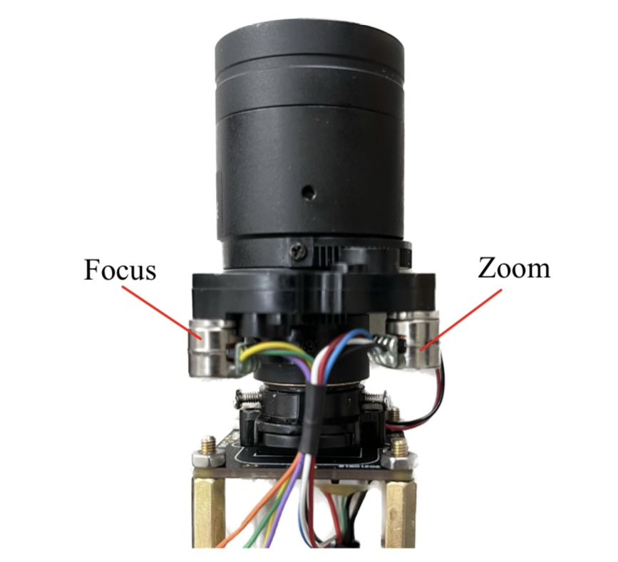
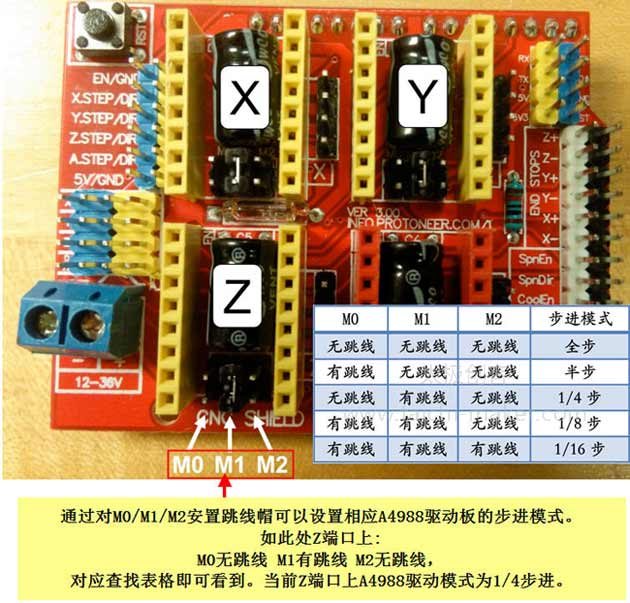
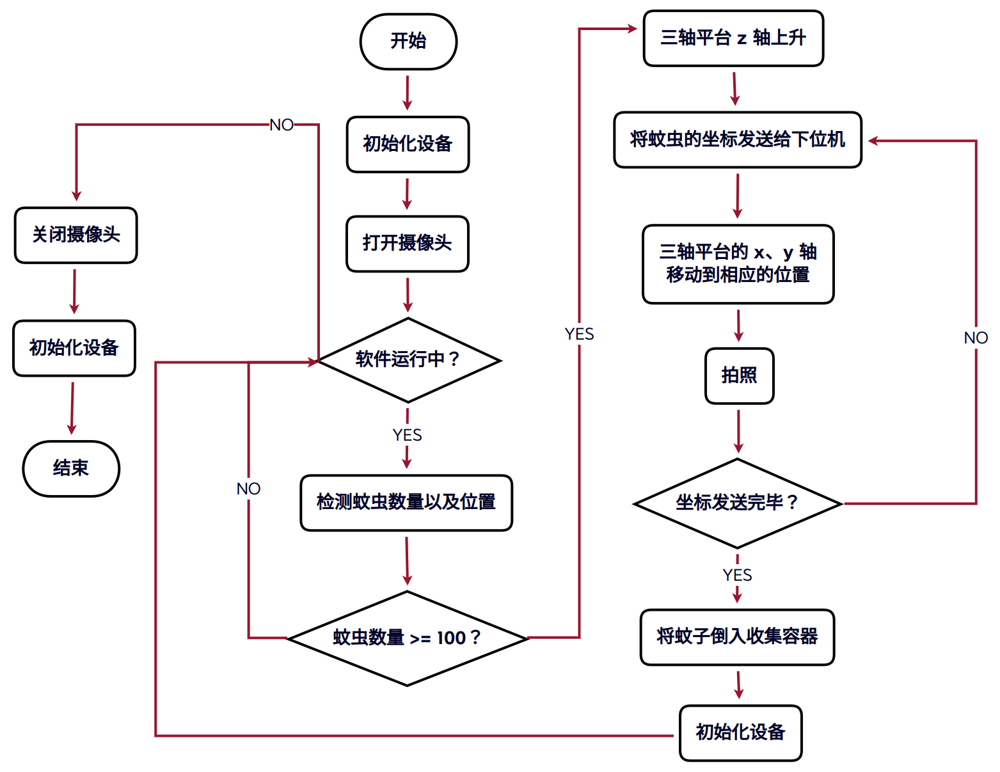
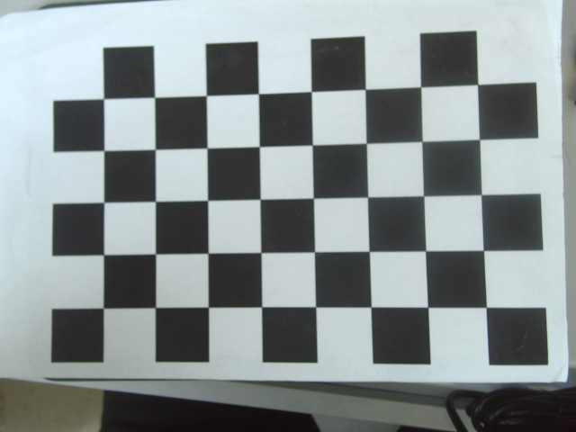
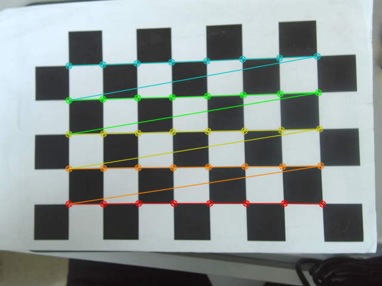
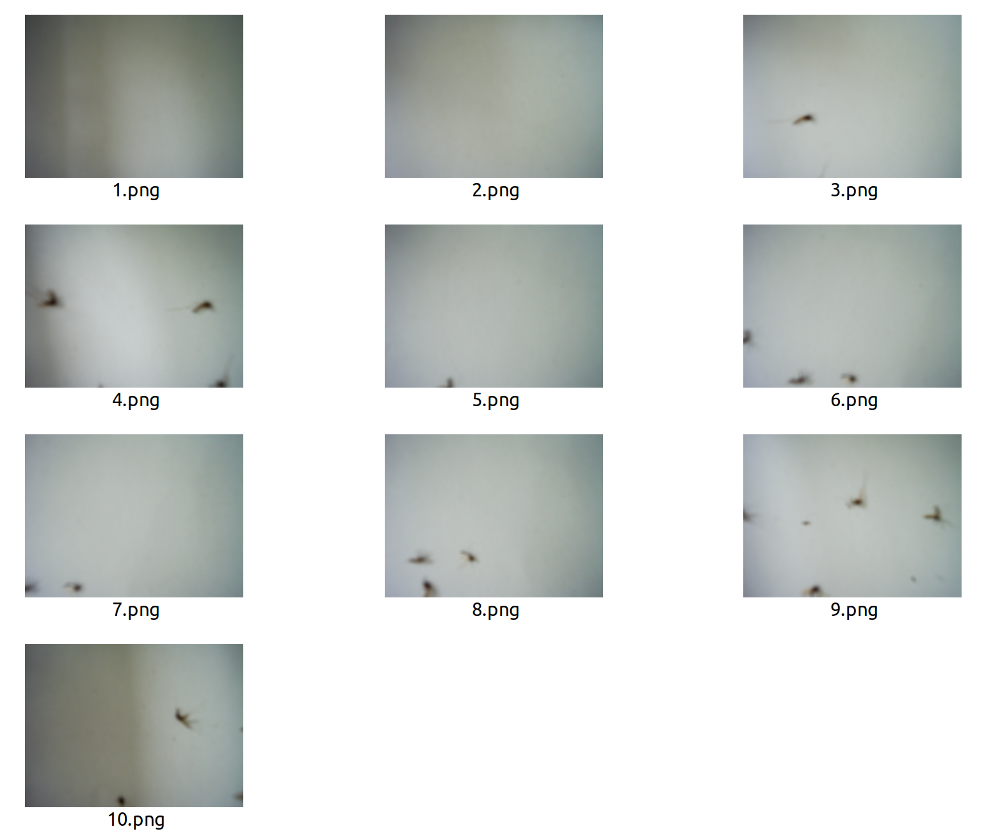
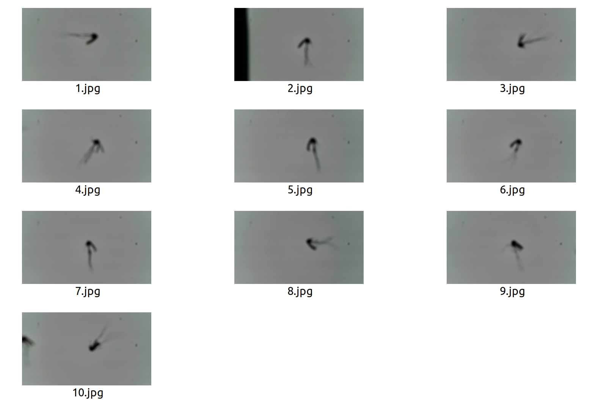

# Mechanical structure & Hardware

## Camera



- $Stepper_{zoom}$：Stoke range is 0 ～ 2750 steps.
  - Forward lead to zoom out ;
  - Reverse lead to zoom in.
- $Stepper_{focus}$ : Stoke range is 0 ～ 2000 steps.
  - If the stepper moves forward, the focal plane will shift up;
  - If the stepper moves backward, the focal plane will shift down.

> There’s no subdivision.


# Embeded computer software（下位机软件）

## Arduino

- freeRTOS
- AccelStepper（GitHub address：https://github.com/waspinator/AccelStepper/releases）

42 Stepper subdivision mode is $\frac{1}{16}$.



## Python

- pyserial

带轮直径：12mm，周长：37.7

两圈距离：80


## 上下位机通信协议

通信 Message 成份构建如下：

```c++
[flag, x, y]
```

其中：

- flag 表示向下位机发送的需要控制某个特定部分的信息码，其二进制表示为：
  - FLAG_INIT（0b1111）：控制设备初始化，或者说复位。
  - FLAG_1（0b1000）：控制振动电机；
  - FLAG_2（0b0100）：控制 z 轴平台；
  - FLAG_3（0b0010）：控制振动盘翻转电机；
  - FLAG_4（0b0001）：控制 x、y 轴移动。
- x：蚊虫的 x 坐标
- y：蚊虫的 y 坐标


# Algrithm

## 算法流程图




## 摄像头真实坐标获取及计算

### 相机标定

打印一张标定板（黑白棋盘格），确定格子的边长（单位：毫米）以及标定板角点的长宽（以角点的列数和行数表示）。

标定板如图：



标定板的角点如图：



该标定板的黑白棋盘格的长为 9 格，宽为 6 格；但是==角点长为 8 个，宽为 5 个==。

Use a ROS2 package “camera_calibration” to calibrate the camera, like this:

```bash
ros2 run camera_calibration cameracalibrator --size 8x5 --square 0.019 image:=/image_raw camera:=/my_camera
```

> - `--size` : Represent the width and height of the corner points.
> - `--square` : Represent the size of black checkerboard square, (unit: m).
> - `image` : Represent the topic that publishes the image data from the camera.

`calibrateCamera.py`

```python
import numpy as np
import cv2

# 定义标定板角点的行列数
points_col_row = (8, 5)

# 生成标定板角点的坐标
points = np.zeros((points_col_row[0] * points_col_row[1], 3), np.float32)
points[:, :2] = np.mgrid[0:points_col_row[0], 0:points_col_row[1]].T.reshape(-1, 2)
points *= 26.64  # 棋盘格边长为26.64毫米

# 存储所有的标定板角点的世界坐标
world_points = []
# 存储所有的标定板角点的图像坐标
image_points = []

# 读取图片
img = cv2.imread('./test.png')
# 转为灰度图
gray = cv2.cvtColor(img, cv2.COLOR_BGR2GRAY)
# 查找标定板角点
ret, corners = cv2.findChessboardCorners(gray, points_col_row, None)
# 如果找到标定板角点（即ret==True），则进行处理
if ret:
    # 存储图像坐标
    image_points.append(corners)
    # 存储世界坐标
    world_points.append(points)

    # 可视化标定板角点
    cv2.drawChessboardCorners(img, points_col_row, corners, ret)
    cv2.imshow('image', img)
    cv2.waitKey(0)

    # 进行相机标定
    ret, mtx, dist, rvecs, tvecs = cv2.calibrateCamera(world_points, 
                                                       image_points, gray.shape[::-1], None, None)

    # 打印标定结果
    print('ret:', ret)
    print('mtx:\n', mtx)
    print('dist:\n', dist)
    print('rvecs:\n', rvecs)
    print('tvecs:\n', tvecs)
```

相机内参矩阵（Camera Intrinsics Matrix）为
$$
K=
\begin{bmatrix}
f_x&0&c_x\\
0&f_y&c_y\\
0&0&1
\end{bmatrix}
$$

### 坐标计算

要通过相机图像像素坐标得到真实世界的物体坐标，需要进行相机标定。相机标定可以得到相机的内参和外参，内参包括相机的焦距、光心等参数，外参包括相机的旋转和平移矩阵。

在进行相机标定后，可以使用以下步骤来将相机图像像素坐标转换为真实世界的物体坐标：

1. 对于给定的像素坐标（$u,v$），计算出其对应的归一化坐标（$x,y$）。归一化坐标是将像素坐标转换为相机坐标系下的坐标，通常使用以下公式进行计算：
   $$
   x = \frac{u - c_x}{f_x}\\
   y = \frac{v - c_y}{f_y}
   $$
   其中，$f_x$ 和 $f_y$ 是相机的焦距，$c_x$ 和 $c_y$ 是相机的光心坐标。	

2. 根据深度值 $d$，计算出对应的点的三维坐标 $(X,Y,Z)$。可以使用以下公式进行计算：
   $$
   X = x \times d\\
   Y = y \times d\\
   Z = d
   $$
   其中，$Z$ 就是深度值，$X$和$Y$的计算使用归一化坐标和深度值相乘即可。	

3. 使用相机的外参将相机坐标系下的坐标转换为真实世界坐标系下的坐标。外参包括相机的旋转矩阵和平移向量，可以使用以下公式将相机坐标系下的坐标 $(X_c,Y_c,Z_c)$ 转换为真实世界坐标系下的坐标 $(X_w,Y_w,Z_w)$：
   $$
   \begin{bmatrix}X_wY_wZ_w\end{bmatrix} = R\begin{bmatrix}X_cY_cZ_c\end{bmatrix} + T
   $$
   其中，$R$ 是相机的旋转矩阵，$T$ 是相机的平移向量。

通过以上步骤，可以将相机图像像素坐标转换为真实世界的物体坐标。需要注意的是，在计算真实世界坐标时，深度值$d$应该与归一化坐标$(x,y)$对应的点的深度值相同。否则，计算出的坐标将不准确。

```c++
/*** 相机高度 ***/
#define DEPTH 100  //毫米
/*** 振动盘尺寸（x、y轴移动范围） ***/
#define WIDTH 220 //毫米
#define HEIGHT 220 //毫米

/*** 相机内参 ***/
typedef struct
{
    double cx, cy;
    double fx, fy;
} cameraParams;

cameraParams params = {334.5708301, 226.02703702, 157.16400469, 156.74578862};

std::vector<std::pair<int, int>> detect(const cv::Mat& img)
{
    cv::Mat img_gray, img_blur, img_binary;
    cv::cvtColor(img, img_gray, cv::COLOR_BGR2GRAY);
    cv::medianBlur(img_gray, img_blur, 3);
    cv::threshold(img_blur, img_binary, 100, 255, cv::THRESH_BINARY_INV);

    cv::Mat out, states, centroids;
    int number = cv::connectedComponentsWithStats(img_binary, out, states,
                                                  centroids, 8, CV_16U);

    //    std::vector<std::pair<uint16_t, uint16_t>> points;
    std::vector<std::pair<int, int>> points;

    for (int i = 1; i < number; ++i)
    {
        /*** 去除小连通区域 ***/
        if (states.at<int>(i, cv::CC_STAT_AREA) < 30)
        {
            continue;
        }
        std::pair<int, int> point;

        /*** 通过相机内参计算出像素坐标对应的真实世界的坐标 ***/
        point.first = ((centroids.at<double>(i, 0) - params.cx) / params.fx) * DEPTH + WIDTH / 2;
        point.second = ((centroids.at<double>(i, 1) - params.cy) / params.fy) * DEPTH + WIDTH / 2;
        points.push_back(point);
    }
    return points;
}
```

### Approach to reduce errors

The error in the obtained result is very large, as we can see.




#### Relative Position Method

提取



#### Compensating for errors


## The approach to vibrate

通过正态分布（Normal Distribution）的最大似然估计（Maximum Likelihood Estimation）获得最大振动次数 $n_{vib}$。


## Focu Stack


# Host Software / Host computer software（上位机软件）

##  ROS2 程序设计

### ROS2 Package

- OpenCV
- cv_bridge
- v4l2_camera


### C++ Dependencies

- Taskflow
