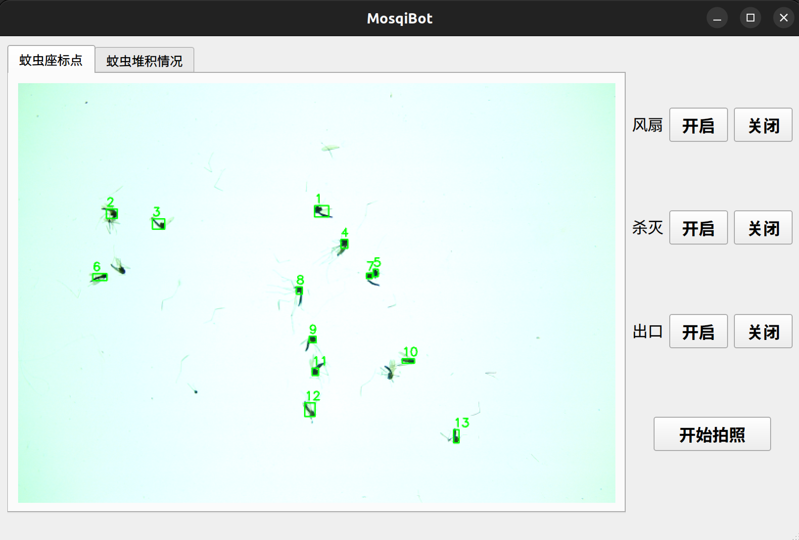

> 作者简介：
>
> 北京化工大学，陈国昊
>
> 邮箱：aventlone@outlook.com

# 昆虫信息采集系统

## 文件夹注释

- `Embedded`：下位机软件；
- `Host`：上位机软件，包括 ROS2 程序和 Qt 图形界面程序；
- `Matlab`：Matlab 脚本文件，用于计算某些参数；
- `Shell`：Shell 脚本文件；
- `test`：测试上位机软件的某些功能。

总体测试效果如下：

## 算法流程图

## Qt 用户界面

## 景深融合

通过控制用于对焦（Focus）的微型步进电机，可以将焦平面移动到靶虫不同的身体部位。

这里由焦平面从上到下，依次拍取 3 张照片：

景深融合结果如下：

## tensorRT 部署 Yolov5模型

推理效果如下

